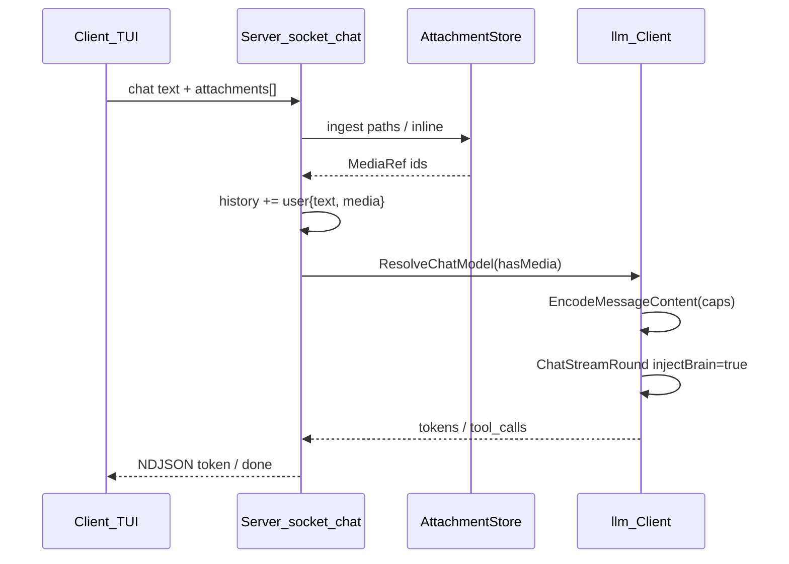

## Cata 系统设计

> **已落地 Phase B–E**：默认 mode 仍为 `_default`；`delegate_mode` + Case；evolve 分桶 + `crystallize_mode`。设计见 vault `design/multi-mode-roles/`。

### 架构概览

```
┌─ 用户 ─┐
    │  cata chat [--dir <产出区>]
    ▼
┌─ Client (internal/client) ─────────────────────────────┐
│  REPL 循环 → Unix Socket → NDJSON 事件流 → 终端渲染     │
└────────────────────────────────────────────────────────┘
    │  Unix Socket (~/.cata/cata.sock)
    ▼
┌─ Server (internal/server) ─────────────────────────────┐
│  连接管理 → 脑子解析 → 聊天循环 → 工具执行               │
│  (managed 模式: 最后一个 chat 断开后自动退出)            │
└────────────────────────────────────────────────────────┘
    │
    ├── LLM (internal/llm) ─── OpenAI 兼容 API
    │
    ├── CATA_HOME (~/.cata/)
    │   ├── global/                    ← 引导型提示词（constraints、behavior、boot-assembler）
    │   └── brain/workspaces/<id>/     ← 运行时记忆
    │       ├── memory/short/current.md
    │       ├── memory/long/、archive/
    │       ├── memory/index.json
    │       ├── meta.json
    │       └── evolution_log.json
    │
    ├── 项目主要内容 (focus_path/.cata/)
    │   ├── persona.local.md
    │   ├── modes/<mode>/persona|behavior|constraints|capabilities.yaml
    │   └── skills/<id>/
    │
    └── Evolve (internal/evolve) ─── 后台异步
        观察 → LLM 决策 → 补丁（项目内容 + home 记忆）→ 索引同步
```

### 核心模型

**两层循环**：

```
外层 while true              对话级，等待触发（用户输入 / cron / 外部事件）
    └── 内层 while true      任务级，LLM + 工具链执行
            └── break: LLM 返回最终文本（无 tool_calls）或超限
```

**两种触发**：
| 触发源 | 说明 |
|--------|------|
| 用户消息 | `cata chat` 交互式对话 |
| 定时演进 | `evolve.cycle_interval`（默认 600s）后台自主运行 |
| 定时任务 | 自托管调度框架 `internal/cata/scheduler` + `cmd/cata/schedule.go`（`cata schedule` 守护）：发现环境任务（机器 + 项目 `.cata/schedules`），`schedules.tick_seconds`（默认 30s）扫描，到点**作为真实 socket 客户端自发起**一轮 chat（`scheduler/runner`）；chat 内 `schedule_task` / `schedule_list` / `schedule_remove` 管理，见 `docs/schedules.md` |

---

### 产出区设计（参考 Claude Code）

核心问题：用户不一定在项目目录下运行 `cata`，需要能指定"在哪个目录干活"。

**方案**：

```
cata chat                         # 产出区 = 当前目录 (默认，向后兼容)
cata chat --dir ~/project         # 产出区 = ~/project
cata chat --dir ~/a --dir ~/b     # 多产出区，第一个是主产出区
```

**产出区 vs 脑子（双根）**：

```
产出区 (output dirs)              CATA_HOME (~/.cata/)           项目 .cata (focus_path/.cata/)
─────────────────────             ─────────────────────          ─────────────────────────────
文件工具、run_command             global/ 引导型提示词             persona.local、modes/*、skills/*
用户代码与构建产物                brain/ws/<id>/ 运行时记忆        可随 git 提交（按需忽略）
                                  config、socket、registry         workspace.yaml 门牌
```

- **产出区** = 用户项目文件（代码、文档、构建产物）
- **引导** = `~/.cata/global/`（全机约束与 SOP；**evolve 不写**）
- **主要内容** = `focus_path/.cata/`（身份、项目说明、mode 文档、技能；**evolve 迭代 active_mode**）
- **运行时记忆** = `~/.cata/brain/workspaces/<id>/`（short/long/archive、index、审计）
- **focus_path** = 从产出区向上查找 `.git` 或 `.cata/workspace.yaml`，决定绑定哪格脑子
- 借鉴 Claude Code：`--add-dir` → cata 的多个 `--dir`；Claude 的 launch dir → cata 的第一个 `--dir` 或 cwd

**规则**：
1. `--dir` 指定的目录成为文件工具和 `run_command` 的操作根目录
2. 文件工具只能访问产出区内的路径（`safePathUnder` 检查）
3. 脑子格子选择基于主产出区解析（`focus_path` 逻辑不变）
4. 同一个产出区目录只能开一个 chat session（output lock 不变）
5. 不同产出区可以并行开多个 chat

---

### 交互层设计：对话交付

**终端**：`cata chat` 使用 Bubble Tea 全屏 TUI（`internal/cata/client/tui.go`），主区对话 + 底栏输入 + 宽屏右侧状态；**不**再依赖 stdout/stderr 分流（不可 `> file` 管道正文）。

#### 事件类型（当前实现）

Server（`internal/cata/server/socket_chat.go`）→ Client（`tui.go` / `stream.go`）单行 JSON：

| `type` | TUI | 字段 |
|--------|-----|------|
| `token` | 主区流式 | `content` |
| `progress` | 侧栏 state | `message` |
| `tool_start` / `tool_result` | 主区 | `name`, `output` |
| `exec_confirm_required` | 列表覆盖层 | `confirm_id`, `argv`, `cwd` |
| `user_choice` | 列表覆盖层 | `id`, `prompt`, `options` |
| `stats` | 右侧栏 | token、round 等 |
| `error` | 主区 | `message` |
| `done` | — | `success`, `cancelled` |

**注意**：`reasoning_content` 只进 LLM history，**不**发 `thinking` 事件。

#### 分级显示（已落地 v0.1.16）

Server 在 `tool_start` / `tool_result` 事件附带 `level` 字段（`silent` / `normal` / `verbose`），由工具名 + 结果判定：read/list 成功 → `silent`；常规编辑/委派 → `normal`；`run_command`、出错 → `verbose`。TUI 按 `displayMode` 渲染：

| CLI | displayMode | 行为 |
|-----|-------------|------|
| （默认） | auto | 按事件 `level`：silent 不显示正文、normal 摘要 400 字、verbose 完整 2000 字 |
| `--quiet` / `-q` | quiet | 工具输出全部静默，只看结论与 token 流 |
| `--verbose` / `-v` | verbose | 所有工具结果完整显示 |

```
# 正常模式（默认）
› add tests for auth
⟳ round 2                                    ← stderr
📄 reading internal/auth/auth.go              ← stderr, tool:start
✏ editing internal/auth/auth_test.go          ← stderr, tool:start
  + func TestAuthenticate(t *testing.T) {     ← stderr, tool:output (normal)
  +   ...
⚙ go test ./internal/auth/...                 ← stderr, tool:start
ok  internal/auth  0.234s                     ← stderr, tool:output (verbose)
我已经添加了测试...                            ← stdout, token stream

# 安静模式 (--quiet)
› add tests for auth
我已经添加了测试...                            ← stdout only，工具静默

# 详细模式 (--verbose)
› add tests for auth
⟳ round 1                                    ← stderr
📄 reading internal/auth/auth.go              ← stderr
  (145 lines)                                 ← stderr, 输出摘要
✏ editing internal/auth/auth_test.go          ← stderr
  + func TestAuthenticate...                  ← stderr, 完整 diff
⚙ go test ./internal/auth/...                 ← stderr
ok  internal/auth  0.234s                     ← stderr, 完整命令输出
我已经添加了测试...                            ← stdout
```

#### 推理/思考（DeepSeek thinking）

- **默认**：不向终端展示；Server 收集后写入 assistant 消息的 `reasoning_content`（tool 轮次 API 要求）
- **`cata chat --show-thinking`**：Server 在流式轮次把 `reasoning_content` 增量下发为 `thinking` 事件，
  TUI 以「┈ 思考中 ┈」块展示（深色），正文到达后自动收块；未开启时不下发、行为不变
- 配置：`config.json` → `llm.thinking`（`auto` / `enabled` / `disabled`），见 `internal/llm/provider.go`

#### 文件操作确认

- `search_replace`：默认不确认（可逆操作）
- `append_file`：默认不确认
- `run_command`：黑名单命令或 `require_confirm` 时弹出确认

---

### 存储层结构（双根）

```
~/.cata/                                    # CATA_HOME
├── config.json
├── cata.sock
├── registry/workspaces.json
├── global/                                 # 引导型提示词（evolve 禁止 patch）
│   ├── constraints.md
│   ├── behavior.md
│   └── boot-assembler.md
├── locks/
├── skills/                                 # 全局共享 skill 回退
└── brain/workspaces/<ws_id>/               # home 脑子格（运行时记忆）
    ├── meta.json
    ├── evolution_log.json
    └── memory/
        ├── index.json
        ├── short/current.md
        ├── long/
        └── archive/

<focus_path>/.cata/                         # 项目主要内容（evolve 维护）
├── workspace.yaml                          # 可选：name、active_mode
├── workspace.link                          # 可选：id → home 格
├── persona.local.md
├── modes/<mode>/
│   ├── persona.md
│   ├── behavior.md
│   ├── constraints.md
│   └── capabilities.yaml
└── skills/<id>/
    ├── SKILL.md
    ├── manifest.yaml
    └── script.*
```

**路径路由**（`internal/cata/brain/ResolveBrainDocAbs`、`chat_paths.go`）：
- `memory/*`、`meta.json`、`evolution_log.json` → home 格
- `persona.local`、`modes/*`、`skills/*` → 项目 `.cata/`
- `global/*` → `~/.cata/global/`

首次 `EnsureScaffold` 会将旧版 home 格内的 persona/modes/skills **迁移**到项目 `.cata/`（`workspace_migrate_project.go`）。

### 记忆与提示词分层

| 层 | 物理位置 | 类型 | 写入方 | 作用 |
|----|----------|------|--------|------|
| Socket 会话历史 | server 内存 | 运行时 | 每轮对话 | 当前 session，`chat_reset` 清空 |
| short/current.md | home 脑子格 | 运行时记忆 | server 每轮追加 | evolve 输入 |
| memory/index.json | home 脑子格 | 运行时记忆 | evolve 同步 | 摘要索引，注入 ②（≤2800B） |
| global/constraints、behavior | ~/.cata/global | **引导** | 用户 / init | 全机硬规则与 SOP；evolve **不写** |
| modes/…/persona 等 | 项目 `.cata/` | **主要内容** | evolve（active_mode） | 身份、项目 SOP，注入 ② |
| persona.local.md | 项目 `.cata/` | **主要内容** | evolve | 仓库用途、栈、当前任务 |
| long/ + archive/ | home 脑子格 | 运行时记忆 | evolve 归档 | 低频事实，经 index 召回 |
| boot-assembler | ~/.cata/global | **引导** | init / 用户 | ① system 前缀 |

### Context 组装（每次终端 LLM 出站前）

**调用链**（终端 chat）：

```
socket_chat history (user/assistant/tool only)
    → llm.Client.ChatStreamRound(..., injectBrain=true)
        → buildHTTPChatRequest
            → withBootLeaderSystemMessage
                → ensureCataBrainExcerptSystem
    → Provider.BuildRequest → HTTP API
```

**代码索引**：

| 职责 | 包 / 符号 |
|------|-----------|
| 注入入口 | `internal/llm/client.go` — `withBootLeaderSystemMessage`, `ensureCataBrainExcerptSystem`, `buildHTTPChatRequest` |
| boot 文件路径 | `internal/cata/brain/paths.go` — `BootLeaderPath()` → `~/.cata/global/boot-assembler.md`（优先）或 `brain/boot-assembler.md` |
| brain 节选正文 | `internal/cata/brain/terminal_context.go` — `TerminalBrainSystemExtension` |
| 路径 / 运行时 | `internal/cata/brain/context_paths.go` — `TerminalPathsSystemBlock`, `SetOutputCwd` |
| Skills 块 | `internal/cata/brain/skills_prompt.go` — `SkillsPromptBlock` |
| 记忆索引块 | `internal/cata/brain/memory_index.go` — `MemoryIndexPromptBlock` |
| 会话 history | `internal/cata/server/socket_chat.go` — 不存 system |
| 日志拆解 | `internal/llm/prompt_log.go` — `buildPromptManifest`（`LLM_LOG_FILE`） |

**发往 API 的 `messages` 顺序**（终端，有 boot 文件时）：

```
[0] system  ① boot-assembler（~/.cata/global/，≤10000 runes）
            · 身份 + 优先级栈 + 交互底线（不写路径表）
[1] system  ② 单条 brain 节选（terminal_context.go），自上而下：
        · 【Cata 路径】TerminalPathsSystemBlock — 仅本轮绝对路径与本机环境
        · 【Cata Skills】capabilities → SKILL.md（项目 skills 优先）
        · memory/index.json 紧凑块（home 格）
        · 【Cata 引导】constraints（写入边界）+ behavior（协作 SOP）
        · 【Cata 项目内容】modes/<active_mode>/persona|behavior|constraints、persona.local
[2…] user / assistant / tool   ← socket 内存 history
```

**防重复原则**：路径路由只写在 constraints；工作方式只写在 behavior；绝对路径只写在路径块；boot 只指向这三层，不复述表格。

**工具**：OpenAI `tools` 数组（`server.buildTerminalChatToolsForTier`：按 ContextTier 内置 + MCP），**不**拼进 system 正文。

**演进与其它 LLM**：

| 调用方 | messages 构造 | 注入 boot/brain |
|--------|---------------|-----------------|
| 终端 chat | history only | 是（`ChatStreamRound` → `withBootLeaderSystemMessage`） |
| `evolve` 决策 | `system`（`evolutionSystemPrompt` 等）+ `user`（`buildDecisionPrompt`） | **否**（`ChatEvolution` → `NoBrainInject`） |
| `Summarize` / 查询预处理 | 内联 `system` + `user` | 是（经 `chat()`） |

**会话压缩**（与 system 无关）：估算 token ≥ `context_window × context_compress_ratio`（默认 85%）→ `evolve.RunSessionCompress` → history 裁到 `context_window × 40%`（`socket_chat.go`）。

**硬限制**（与代码常量一致）：

| 项 | 上限 | 位置 |
|----|------|------|
| boot-assembler | 10000 runes | `maxBootLeaderRunes` |
| 单文件 brain 摘录 | 6500 bytes | `maxBrainExcerptBytesPerFile` |
| brain 摘录合计 | 20000 bytes | `maxBrainExcerptBytesTotal` |
| memory/index 注入 | 2800 bytes | `maxIndexPromptBytes` |
| 单 skill / 合计 | 8000 / 16000 bytes | `skills_prompt.go` |
| short-term 文件 | 96KB | `session_memory.go` |

### 自主演进

```
双根 patch（per workspace，active_mode）:
    主要内容 → focus_path/.cata/（persona.local、modes/<active_mode>/*、skills/*）
    运行时记忆 → ~/.cata/brain/workspaces/<id>/（memory/*、meta.json、evolution_log.json）
    禁止 → global/*（引导层）

触发条件:
    short-term 有新内容（见 internal/cata/evolve/gate.go）
    或 fill:*（项目 .cata 空壳文档须本轮填充）

周期:
    默认 600s，由 evolution.cycle_interval 控制

动作:
    observe → LLM 决策 (idle|consolidate|crystallize_skill|…) → ApplyUpdates → 确定性 compact（去重）→ 索引同步

项目主要内容约束:
    按意图选 patch 模式（见 prompt/evolve/patch_modes.md）
    更新已有 ## 节 → replace_section；memory 流水 → append；fill/compact → overwrite
    超 3500B 触发 compact:*；补丁后 CompactMarkdown 去重

决策 prompt 含: workspace_scope（id、focus_path、active_mode、project_cata、home_brain）

无手动演进命令。
```

### 保护机制

```
内层循环:
    上下文超 context_window × 85% → 触发 session compress → 历史截断到 40%
    单轮最大 tool 轮次限制（隐式，由 token 预算控制）

工具执行:
    run_command 输出上限 256KB
    命令黑名单 + 用户确认
    路径遍历防护 (safePathUnder)

并发:
    同一产出区只能一个 chat session（output lock）
    同一机只能一个 server（socket 文件锁）
    记忆读写由 evolve 引擎串行化（单 goroutine）

记忆膨胀:
    short/current.md 上限 96KB → 触发 trim
    modes/<mode>/persona.md 超 6500 bytes → 触发 consolidate（写入项目 .cata）
    index.json 超 2800 bytes → 触发 summary 压缩
```

### 多模态（设计，未实现）

**目标**：终端 chat 可向模型附带**图片**（后续可扩 PDF/音频）；**换模型**时只改配置，不改业务代码路径。  
**非目标（v1）**：演进 LLM、Summarize、MCP 默认不走 vision；不做视频流；不在 `~/.cata` 脑子正文里存原图。

#### 现状缺口

| 层 | 今天 | 缺口 |
|----|------|------|
| `llm.Message` | `Content string` | 无法表达 OpenAI 式 `content: [{type,text},{type,image_url}]` |
| `messagesForChatCompletionsWire` | 一律 `content: string` | 出站前需按能力编码 |
| Socket `chat` | 仅 `text` | 无附件字段 |
| TUI | 纯文本输入 | 无粘贴图 / `@文件` |
| Token 估算 | 按字符 | 图片需单独预算 |
| `models` 按角色 | `chat` / `evolution` | 无「有图时用哪模型」策略 |

#### 能力模型（可切换多模态模型）

在 `~/.cata/config.json` 增加 **`llm.capabilities`**（按**模型名**键，与 `llm.model` / `llm.models.*` 解耦）：

```json
{
  "llm": {
    "provider": "openai",
    "api_url": "https://api.openai.com/v1/chat/completions",
    "model": "deepseek-v4-flash",
    "models": {
      "default": "deepseek-v4-flash",
      "chat": "deepseek-v4-flash",
      "chat_vision": "gpt-4o"
    },
    "capabilities": {
      "deepseek-v4-flash": { "modalities": ["text"] },
      "gpt-4o": {
        "modalities": ["text", "image"],
        "max_images_per_message": 4,
        "max_image_bytes": 10485760,
        "image_mime_allow": ["image/png", "image/jpeg", "image/webp", "image/gif"]
      }
    }
  }
}
```

**运行时选模型**（`internal/llm`，新符号 `ResolveChatModel(turn TurnInput)`）：

```
若本 turn 无附件 → models["chat"] ?? model
若本 turn 有图：
  若当前 chat 模型 capabilities 含 image → 继续用 chat 模型
  否则若配置了 models["chat_vision"] 且该模型支持 image → 换用 chat_vision
  否则 → 向客户端返回 error（NDJSON），不静默丢图
```

演进 / 摘要仍用 `RoleEvolution` / `RoleSummarize`，**不**因用户附图切换；`capabilities` 缺省时对未知模型保守视为 **仅 text**。

| 配置键 | 含义 |
|--------|------|
| `modalities` | `text` \| `image`（v2+ 可加 `audio`、`document`） |
| `max_images_per_message` | 单条 user 消息最多几张 |
| `max_image_bytes` | 单张解码后上限 |
| `image_mime_allow` | 白名单 MIME |

换供应商时：只改 `api_url` + `model` + `capabilities` 三条，**不改** server 工具循环与 socket 协议字段名。

#### 内容表示（`internal/llm`）

**原则**：内存 history 与 API wire **解耦**——history 存引用，出站再展开为 provider 格式。

```go
// 会话 history（socket 内存）— 建议新类型，与现有 string Content 并存一段时间
type UserTurn struct {
    Text          string
    AttachmentIDs []string // 指向 AttachmentStore
}

type Message struct {
    Role    string
    Content string // 仍用于 system / 纯文本 user / assistant / tool
    Media   []MediaRef `json:"media,omitempty"` // 仅 role=user 且为「多模态轮次」时使用
}

type MediaRef struct {
    ID   string
    MIME string
    // 可选：宽高等元数据，供 TUI 展示
}
```

**出站编码**（`Provider` 扩展或 `EncodeMessageContent(cap ModelCaps, m Message) any`）：

- **text-only 模型**：`content` 仍为 string；图片轮次在出站前**拒绝**或要求用户改配置（见上）。
- **vision 模型**：user 消息 `content` 为数组：
  - `{ "type": "text", "text": "..." }`
  - `{ "type": "image_url", "image_url": { "url": "data:<mime>;base64,..." } }`  
  兼容网关若要求 `image` 字段，由 `OpenAIProvider` 子策略或 `provider_variant` 配置切换（实现期再定，接口统一进 `Capabilities.WireImagePart`）。

`assistant` / `tool` / `system` **保持字符串**；模型返回的图片（若未来 API 支持）v1 只记文本描述，不进 history 二进制。

#### 附件生命周期

```
产出区路径 / TUI 粘贴 / 未来 MCP 截图
        ↓ ingest（校验 MIME、大小、路径 safePathUnder）
        ↓ AttachmentStore.Write → ~/.cata/cache/attachments/<ws>/<uuid>
        ↓ history 只保留 MediaRef{id,mime}
        ↓ 出站时 Read + base64 data URL（或供应商支持的 URL）
        ↓ chat_reset / 会话结束 → 按 TTL 或随 reset 清理 cache
```

| 规则 | 说明 |
|------|------|
| 可读路径 | 仅 **产出区**内相对/绝对路径 + 可选 `CATA_ATTACH_DIR` 白名单目录 |
| 禁止 | 直接读 `~/.cata/brain/**` 原图进模型（防泄露脑子全文） |
| short-term 记忆 | **只写** `text` + `[attachments: a.png, …]` 一行摘要，**不写** base64 |
| 会话压缩 | 优先裁掉**最早**带 `Media` 的 user 轮中的图片（保留文本）；或压缩任务里让 LLM 用文字描述图意后删 `Media` |
| evolve | 观察 short-term 的文本摘要即可，不读 cache |

#### Socket / Client 协议扩展

**请求**（`server.Request`，向后兼容）：

```json
{
  "command": "chat",
  "text": "这张图里有什么？",
  "stream": true,
  "cwd": "D:\\stock",
  "attachments": [
    { "path": "charts/k.png" },
    { "inline": { "mime": "image/png", "base64": "..." } }
  ]
}
```

| 字段 | 说明 |
|------|------|
| `attachments[].path` | 相对产出区或绝对路径（经 `safePathUnder`） |
| `attachments[].inline` | TUI 粘贴/拖拽时用，server 落盘后进 Store |
| 上限 | 与 `max_images_per_message` 对齐，超出 → `error` 事件 |

**事件**（可选，便于 TUI）：

| `type` | 字段 | 说明 |
|--------|------|------|
| `attachment_rejected` | `reason`, `path` | 超限 / MIME / 路径非法 |
| `model_switch` | `from`, `to`, `reason` | 本 round 因附图切换 `chat_vision` |

**TUI（`internal/cata/client`）**：

| 操作 | 行为 |
|------|------|
| `/attach <path>` | 加入待发送附件列表，底栏提示 `[1] k.png` |
| 粘贴（Phase 2） | 剪贴板 PNG → `inline` |
| 发送 | `text` + `attachments` 一并提交 |
| 主区展示 | 不嵌大图，一行 `[image: k.png 800×600 42KB]` |

#### 调用链（附图的一轮）



#### Token 与保护

- `EstimatedChatInputTokens`：文本仍用字符启发式；每张图加 **`image_token_estimate`**（配置项，默认按 512×512 tile 粗算，或固定 1000/token 占位直至接 tiktoken）。
- 上下文压缩阈值触发时：**先**尝试去掉旧轮 `Media` 再裁消息条数。
- `max_read_bytes` 与附件分离；单张图默认 ≤ 10MB（可配置）。

#### Provider 抽象（便于换模型）

```
Provider (现有)
  + CapabilitiesForModel(model string) ModelCaps
  + EncodeUserContent(m Message, caps ModelCaps) (wire any, err error)
```

DeepSeek / 千问 / OpenAI / 本地 vLLM 差异集中在 **EncodeUserContent**（如是否接受 `image_url`、是否必须 https URL）。业务代码只依赖 `llm.Message` + `MediaRef`。

#### 分阶段实现

| 阶段 | 内容 | 验收 |
|------|------|------|
| **M0** | `capabilities` 配置解析；`ResolveChatModel`；无附件时行为不变 | 改 config 换模型名即可 |
| **M1** | `AttachmentStore` + socket `attachments` + history `MediaRef` + wire 数组 | `chat` + JSON 附件路径可问图 |
| **M2** | TUI `/attach`、发送栏附件提示、`model_switch` 事件 | 交互式附图 |
| **M3** | 粘贴图、压缩策略、token 估算调优 | 长会话不爆窗 |
| **M4** | 文档页（PDF→图或 text extract）、音频 | 按所选模型 capabilities 启用 |

**建议改动的包**（实现时）：`internal/cata/config`、`internal/llm`（Message、wire、tokens）、`internal/cata/server`（ingest、history）、`internal/cata/client`（TUI、session req）、新建 `internal/attachment`（可选）。

**刻意不做（与多模态相关）**：不把图片写入 `memory/short/current.md` 全文；不让 evolve 自动选 vision 模型；不在 v1 支持「管道 `cata chat < img.png`」。

---

### 子 Agent（delegate_task / worker）

主 Agent（`llm.models.chat`）负责规划与整合；**worker**（`llm.models.worker`）执行有界子任务，降低成本。

| 项 | 行为 |
|----|------|
| 触发 | 仅主 Agent 调用 `delegate_task` |
| 上下文 | worker **不注入** boot/brain；仅 task + context + 工具结果 |
| 工具 | 默认全套（可 `subagent.default_tools` 白名单）；禁止 `ask_user`、嵌套 `delegate_task` |
| 并行 | `subagent.max_concurrent`（默认 4）；槽满时 `subagent_queued` 事件 |
| 收集 | `delegate_wait`：`ids` 拉指定任务（含已完成）；`all:true` 本会话全部；空 ids 仅等运行中 |
| 留痕 | `~/.cata/subagent_runs/<产出区路径_.csv>`；`delegate_wait` 摘要写入 short-term |
| 审计 | `llm.log` 中 `kind: worker_round` + `subagent_id` + `session_id` |

**browser/MCP**：勿多 worker 并行浏览器；宜父 Agent 串行或单 worker + tools 白名单。

---

### 刻意排除

- 无手动演进命令（纯后台自主运行）
- 无任务队列（有轻量定时触发 `internal/cata/scheduler`，见 `docs/schedules.md`）；调度 CLI 仅 `cata schedule [--once] [--dir] [--tick]` 守护/一次性扫描（无任务编排）
- 无内置 git 操作
- 无独立 TUI Web UI（终端为主；`cata-gateway` 自带本机管理控制台与远程模式，见 `docs/gateway.md`）
- 无多机分布式（网关 remote 模式为「云端注册中心 + 各机 agent 回连」，见 `docs/tunnel.md`）
- 无 `catacli` 独立二进制（统一 `cata` TUI）
